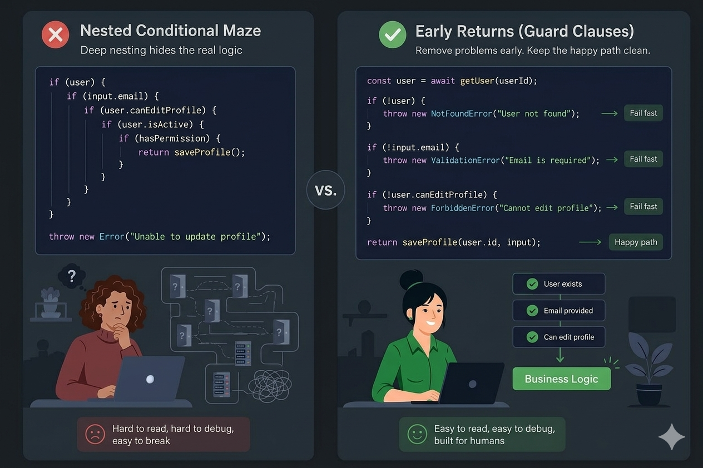
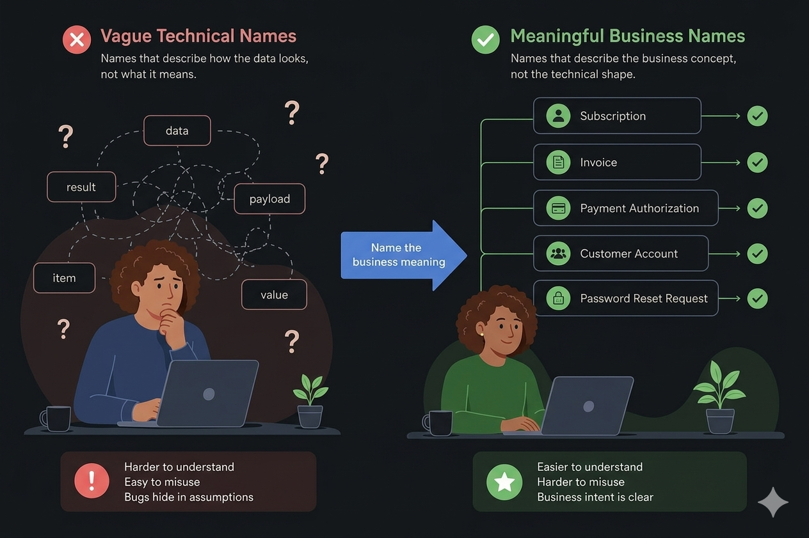
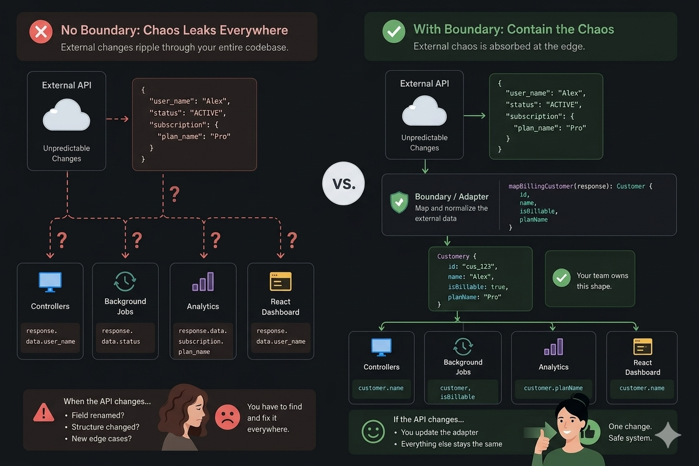
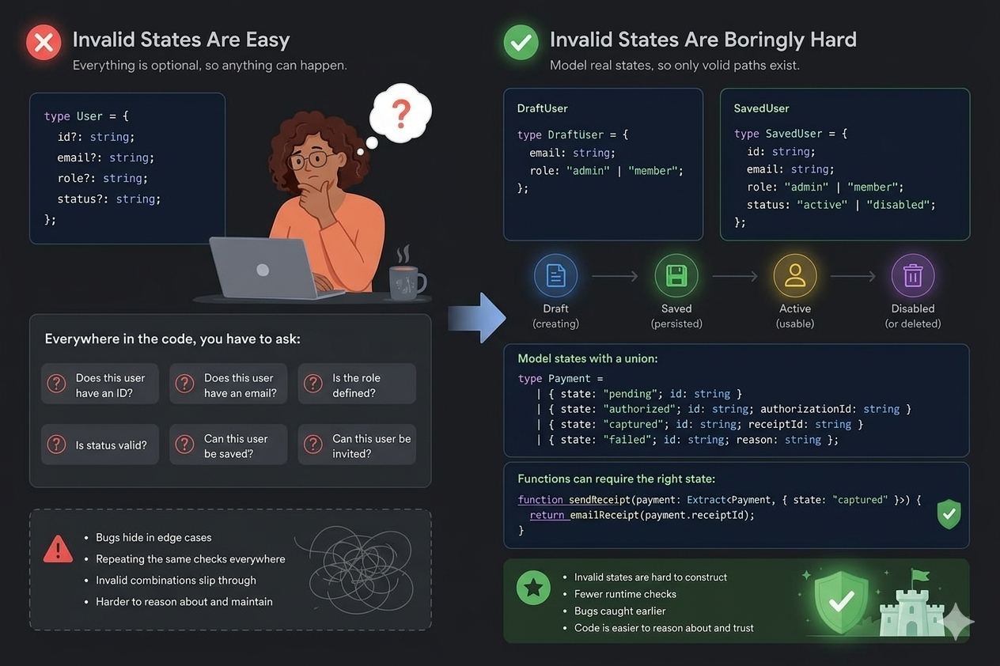
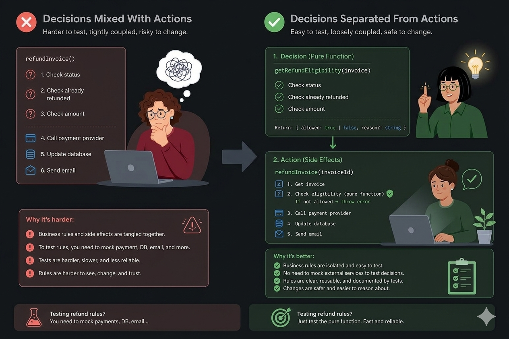
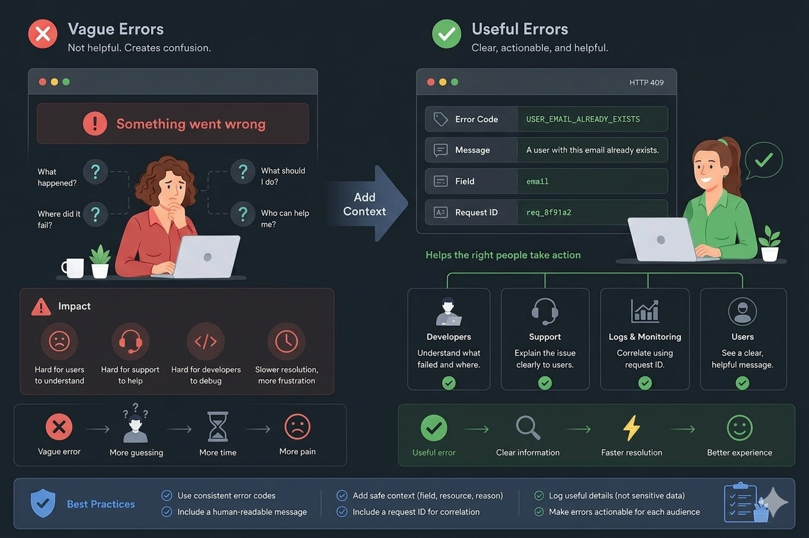
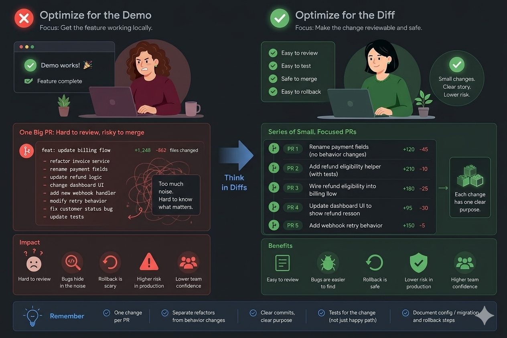

# 🧭 Production-Ready Coding Habits — Project Guide

> **Apply these on real codebases.** They are not library-specific shortcuts. They are habits of judgment that surface bugs faster, simplify refactors, and reduce accidental misuse.

Early-career developers often assume experienced engineers succeed because they know more syntax.

In most cases, that is not the main gap.

**They leave behind code that is easier to maintain than they found it.**

That gap shows up painfully over time.

---

## 📖 Table of Contents

1. [Exit Early With Guard Clauses](#-1-exit-early-with-guard-clauses)
2. [Choose Domain-Driven Names](#-2-choose-domain-driven-names)
3. [Isolate Third-Party Data](#-3-isolate-third-party-data)
4. [Model States Explicitly](#-4-model-states-explicitly)
5. [Split Rules From Side Effects](#-5-split-rules-from-side-effects)
6. [Design Errors People Can Act On](#-6-design-errors-people-can-act-on)
7. [Ship Small, Reviewable Changes](#-7-ship-small-reviewable-changes)
8. [What All Seven Habits Share](#-what-all-seven-habits-share)
9. [Pre-PR Checklist](#-pre-pr-checklist)

---

## 💡 Introduction

For a long time I equated quality with cleverness — elegant abstractions, impressive one-liners, code that looked sharp in a screenshot.

Then I paired with engineers who had shepherded systems through outages, emergency rollbacks, partial migrations, ownership disputes, customer escalations, and repositories everyone avoided.

Their work rarely looked clever. It rarely showed off. It would not trend anywhere.

**It looked plain.**

Then priorities shifted — and their code still worked.

That is when these habits clicked for me.

What I picked up was not a bag of React tips, Node recipes, Java idioms, or cloud checklists. It was **how to think while writing code**.

Below are seven habits worth using on every project.

---

## ✅ 1. Exit Early With Guard Clauses

Habit number one is almost too simple: **handle invalid cases first and get out**.

<div align="center">



</div>

I used to stack conditions so the core logic sank deeper with every check — user exists, input valid, permission granted, flag enabled, database row found. By the time the actual work ran, the reader was five levels in and tracking too many assumptions.

Strong engineers flip that order. **They eliminate dead ends up front.**

### ✅ Preferred approach — guard clauses

```typescript
async function updateUserProfile(userId: string, input: ProfileInput) {
  const user = await getUser(userId);

  if (!user) {
    throw new NotFoundError("User not found");
  }

  if (!input.email) {
    throw new ValidationError("Email is required");
  }

  if (!user.canEditProfile) {
    throw new ForbiddenError("User cannot edit profile");
  }

  return saveProfile(user.id, input);
}
```

No one earns praise for saying they added guard clauses. Still, this shape changes incident response.

- ✅ Rejection paths sit at the top where you see them
- ✅ The success path stays flat and obvious
- ✅ The flow matches how engineers reason when something breaks at 2 a.m.

### ❌ Problematic approach — deep nesting

```typescript
async function updateUserProfile(userId: string, input: ProfileInput) {
  const user = await getUser(userId);

  if (user) {
    if (input.email) {
      if (user.canEditProfile) {
        return saveProfile(user.id, input);
      }
    }
  }

  throw new Error("Unable to update profile");
}
```

It survives code review because it is short. Then account status checks land. Then org-level permissions. Then email verification. Then audit hooks. **Suddenly the function is a labyrinth.**

Deep nesting obscures intent. It asks the reader to remember which branches are still open.

Maintainers spend more time reading than authors spend typing. Write for the reader under stress.

> **When nesting is fine:** Tree walks, parsers, and workflows with genuine hierarchy may need nested structure. The goal is not zero nesting — it is **not forcing someone through five locked doors to reach the point**.

### 🎯 Key point

> Clear failure paths first. Let the main logic stay readable.

---

## ✅ 2. Choose Domain-Driven Names

Weak naming is not a style issue.

**It is unpaid debugging work for the next person.**

<div align="center">



</div>

Many codebases label things by storage shape instead of purpose:

`data`, `result`, `item`, `payload`, `response`, `temp`, `obj`, `list`, `value`

Everything builds. QA passes. The team ships.

Months later the meaning drifts:

- `data` actually means a user record
- `result` is really a payment authorization
- `payload` is a password-reset request
- `items` are unpaid invoices — except when canceled ones slip in after a filter change

Experienced engineers name for **domain meaning** because that survives refactors and vendor swaps.

### ❌ Shape-based naming

```typescript
const result = await getData(id);

if (result.status === "active") {
  await process(result);
}
```

### ✅ Purpose-based naming

```typescript
const subscription = await getSubscription(subscriptionId);

if (subscription.isBillable) {
  await chargeSubscription(subscription);
}
```

The second snippet answers different questions:

- The entity is a **subscription**, not anonymous data
- The gate is **billability**, not a generic active flag

### 🐛 Production confusion from vague labels

| Identifier | Common assumption | Actual behavior |
|------------|-------------------|-----------------|
| `activeUsers` | Currently active accounts | Included suspended, not-yet-deleted users |
| `syncCustomer` | Read-only sync | Also generated invoices |
| `isValid` | Safe to save | Passed client-side validation only |

Precise names add friction against wrong usage:

```typescript
const usersEligibleForReactivation = await findUsersEligibleForReactivation();
```

Longer? Yes. **That is the point.**

Length is cheap when it encodes a rule someone would otherwise have to rediscover. Brevity that hides meaning just exports complexity to the next reader.

> **Balance:** Not every symbol needs a paragraph. Index variables can stay short. Invest naming effort where **business risk** lives.

### 🎯 Key point

> Let names document intent so nobody has to decode implementation details to understand behavior.

---

## ✅ 3. Isolate Third-Party Data

Treat every external dependency as capable of breaking your assumptions without warning.

<div align="center">



</div>

Vendor APIs rename fields. Webhooks arrive out of order. Documentation lies. Payment gateways return odd partial failures. Tokens expire mid-request. Date strings arrive in formats you did not expect. A quick integration becomes load-bearing across the product.

Inexperienced code often consumes vendor shapes directly:

```typescript
const userName = response.data.user_name;
const isActive = response.data.status === "ACTIVE";
const plan = response.data.subscription.plan_name;
```

One file becomes two. Then ten. Eventually your domain speaks the vendor's dialect. **Their schema becomes your architecture.**

The fix is a translation layer at the edge:

```typescript
function mapBillingCustomer(response: BillingCustomerResponse): Customer {
  return {
    id: response.id,
    name: response.user_name,
    isBillable: response.status === "ACTIVE",
    planName: response.subscription?.plan_name ?? "Free",
  };
}
```

That is more than a mapper. **It is a firewall.**

Downstream code should not care if the vendor uses `user_name`, `customerName`, or `profile.display_name`. Internal modules should consume **types your team defines**.

### 📌 Where to draw lines

- 🚫 Raw SQL rows feeding UI components directly
- 🚫 HTTP JSON shapes inside domain services
- 🚫 Framework request objects passed deep into business logic
- 🚫 Environment variables parsed ad hoc in random modules
- 🚫 Stripe, Slack, GitHub, Salesforce vocabulary scattered everywhere

When a partner renames one field, the patch itself is trivial. **Hunting every reference across controllers, jobs, analytics, and UI is the expensive part.** A single adapter test should have caught it.

> **Pragmatism:** Tiny tools may not need heavy mapping. Once the same external payload crosses multiple features, centralize translation before it spreads.

### 🎯 Key point

> External systems must not dictate the vocabulary of code you own.

---

## ✅ 4. Model States Explicitly

During a review I once heard: *"This design allows impossible combinations."*

The feature passed QA. It failed in production two weeks later.

<div align="center">



</div>

The type looked like this:

```typescript
type User = {
  id?: string;
  email?: string;
  role?: string;
  status?: string;
};
```

Every field optional — not because the domain allows emptiness, but because the compiler stopped warning. **That silences the tool without securing the model.**

Call sites then repeat the same defensive questions:

- Is there an ID yet?
- Is email present?
- Is role set?
- Is status in an allowed set?
- Can we persist this record?
- Can we render it?
- Can we send an invite?

Better designs separate lifecycle stages:

```typescript
type DraftUser = {
  email: string;
  role: "admin" | "member";
};

type SavedUser = {
  id: string;
  email: string;
  role: "admin" | "member";
  status: "active" | "disabled";
};
```

The type system now states an obvious truth: **a draft is not the same thing as a persisted user.**

### Why loose modeling hurts

Payments move through pending → authorized → captured → failed → refunded → disputed.

Orders move through cart → submitted → fulfilled → canceled → returned.

Users move through invited → active → suspended → deleted → pending verification.

Blur all of that into one baggy type and the same mistakes repeat:

- 📧 Notifications to unverified addresses
- 💳 Refunds before capture
- 🖥️ UI actions for accounts still onboarding

Tighten the model so illegal combinations fail earlier:

```typescript
type Payment =
  | { state: "pending"; id: string }
  | { state: "authorized"; id: string; authorizationId: string }
  | { state: "captured"; id: string; receiptId: string }
  | { state: "failed"; id: string; reason: string };

function sendReceipt(payment: Extract<Payment, { state: "captured" }>) {
  return emailReceipt(payment.receiptId);
}
```

Static types are one option. The same discipline works with runtime schemas, constructors, validators, or factories in dynamic languages.

### 🎯 Key point

> Do not only catch bad states at runtime. Structure the code so many invalid states never compile or construct in the first place.

---

## ✅ 5. Split Rules From Side Effects

A high-leverage refactor: **keep policy logic pure; keep I/O elsewhere**.

<div align="center">



</div>

Mixed style — rules and infrastructure in one place:

```typescript
async function refundInvoice(invoiceId: string) {
  const invoice = await getInvoice(invoiceId);

  if (invoice.status !== "paid") {
    throw new Error("Invoice cannot be refunded");
  }

  if (invoice.refundedAt) {
    throw new Error("Invoice already refunded");
  }

  if (invoice.amount <= 0) {
    throw new Error("Invalid refund amount");
  }

  await paymentProvider.refund(invoice.paymentId);
  await markInvoiceRefunded(invoice.id);
  await sendRefundEmail(invoice.customerId);
}
```

Readable on first glance. Yet **eligibility checks and side effects share one function**.

Testing refund rules now means stubbing payments, databases, and mailers. Tests get slow and brittle. Teams skip them. **Policy regressions follow.**

### ✅ Extract policy into a pure helper

```typescript
function getRefundEligibility(invoice: Invoice): RefundEligibility {
  if (invoice.status !== "paid") {
    return { allowed: false, reason: "Invoice is not paid" };
  }

  if (invoice.refundedAt) {
    return { allowed: false, reason: "Invoice is already refunded" };
  }

  if (invoice.amount <= 0) {
    return { allowed: false, reason: "Invalid refund amount" };
  }

  return { allowed: true };
}
```

Orchestration stays thin:

```typescript
async function refundInvoice(invoiceId: string) {
  const invoice = await getInvoice(invoiceId);
  const eligibility = getRefundEligibility(invoice);

  if (!eligibility.allowed) {
    throw new ValidationError(eligibility.reason);
  }

  await paymentProvider.refund(invoice.paymentId);
  await markInvoiceRefunded(invoice.id);
  await sendRefundEmail(invoice.customerId);
}
```

Rules become unit-testable **without standing up the whole stack**. That is the payoff.

### 📌 Good fits for this split

Permission checks · feature flags · pricing · validation · routing · retries · notifications · workflow transitions · scheduling

> **Do not over-split:** Three lines of obvious logic does not need a framework. Extract when the rule has **real business risk** — then name it and test it.

### 🎯 Key point

> Policy should be verifiable on its own, without executing the side effects it governs.

---

## ✅ 6. Design Errors People Can Act On

Generic failures often protect the author's time more than the team's.

<div align="center">



</div>

The UI shows:

> **Something went wrong**

Who does that help?

Not the customer. Not support. Not on-call. Not whoever greps logs at midnight. Not the frontend mapping states. Not the engineer correlating a trace.

Treat failures as **structured messages** with audiences.

A responsible error avoids leaking secrets, stack traces in the browser, or attacker-friendly internals — while still giving each role enough signal to proceed.

### ❌ Unhelpful API payload

```json
{
  "message": "Something went wrong"
}
```

### ✅ Actionable API payload

```json
{
  "code": "USER_EMAIL_ALREADY_EXISTS",
  "message": "A user with this email already exists.",
  "details": {
    "field": "email"
  },
  "requestId": "req_8f91a2"
}
```

Field names vary by team — `errorCode`, `type`, RFC 7807 problem details, request IDs in headers. All acceptable.

What fails is shipping only human prose and expecting clients, dashboards, and runbooks to infer meaning.

### 🚫 Do not branch on error message text

```typescript
// Breaks when copy changes — avoid this
if (error.message.includes("already exists")) {
  showEmailTakenError();
}
```

Wording shifts, translations land, another endpoint returns similar text — and the UI misbehaves.

**Humans read messages. Programs read stable codes.**

### ✅ Log with correlation and safe fields

```typescript
logger.warn("Refund rejected", {
  invoiceId,
  customerId,
  reason: eligibility.reason,
  requestId,
});
```

Log selectively. Never log credentials, tokens, PANs, or personal data you do not need. Do log identifiers and reasons that shorten incident triage.

### 🎯 Key point

> A useful error states what broke, where it broke, and how to tie it to logs or support workflows.

---

## ✅ 7. Ship Small, Reviewable Changes

Many developers optimize for *works on my machine*.

Experienced teams optimize for *safe for others to merge*.

<div align="center">



</div>

The gap matters.

A demo can succeed while the change set remains risky:

- Too many modules touched at once
- Refactors bundled with behavior changes
- Tests covering only the sunny path
- Migrations buried in unrelated edits
- Config updates undocumented
- No clear rollback story

**The feature demos fine. Operational risk goes up.**

Teams learn through diffs. A readable diff tells a story; a noisy one turns review into archaeology.

### ❌ Single oversized pull request

```
feat: update billing flow
- refactor invoice service
- rename payment fields
- update refund logic
- change dashboard UI
- add new webhook handler
- modify retry behavior
- fix customer status bug
- update tests
```

Reviewers cannot separate necessary work from drive-by edits. Defects hide in volume. Reverting becomes frightening.

### ✅ Sequence of narrow pull requests

| PR | Scope |
|----|-------|
| **PR 1** | Rename payment fields without behavior changes |
| **PR 2** | Add refund eligibility helper with tests |
| **PR 3** | Wire refund eligibility into billing flow |
| **PR 4** | Update dashboard UI to show refund reason |
| **PR 5** | Add webhook retry behavior |

Measured by keystrokes alone, this feels slower. Measured by review time, defect rate, rollback ease, and team trust, it wins.

Refactoring still happens — it just does not hide inside feature work, and features do not hide inside cleanup.

When production breaks, a tight diff is a lifesaver. A kitchen-sink diff is a liability.

### 🎯 Key point

> Finished means reviewable, test-covered, documented where needed, and reversible — not merely runnable locally.

---

## 🧩 What All Seven Habits Share

On the surface these practices look unrelated:

| Habit | In one sentence |
|-------|-----------------|
| 🛡️ Guard clauses | Reject invalid input before core logic runs |
| 🏷️ Domain names | Encode business intent in identifiers |
| 🔒 Isolation layers | Stop vendor formats from infecting internals |
| 📐 Explicit states | Represent lifecycle stages honestly |
| ⚖️ Pure policy | Test rules without external dependencies |
| 💬 Structured errors | Give humans words and machines codes |
| 📝 Small diffs | Deliver change in reviewable slices |

They converge on one principle:

## **Minimize unexpected behavior.**

Complexity is unavoidable. The choice is whether it lives in **explicit code** or in **every developer's head**.

When surprise accumulates in people's minds, delivery slows. Confidence drops. Engineers manually re-test what they do not trust. Old modules become no-go zones. Small tickets feel large.

That hesitation usually reflects the repository — not the person.

The strongest contributors I have seen were not performing intelligence. They were **lowering the cost of the next edit**.

---

> **Strong code is not a resume for the author.**
>
> **Strong code reduces how much the next reader must infer.**

---

## 📋 Pre-PR Checklist

Run through this before you request review:

- [ ] 🛡️ **Guard clauses** — Invalid cases handled upfront? Success path easy to scan?
- [ ] 🏷️ **Naming** — Do risky concepts use domain language, not generic placeholders?
- [ ] 🔒 **Boundaries** — External payloads mapped before reuse across modules?
- [ ] 📐 **States** — Are optional fields masking illegal combinations?
- [ ] ⚖️ **Policy split** — Can business rules be unit-tested without I/O mocks?
- [ ] 💬 **Errors** — Stable codes, safe context, and correlation IDs present?
- [ ] 📝 **Diff size** — One purpose per PR? Refactors separated from behavior?

---

*Practical engineering habits for day-to-day project work.*
